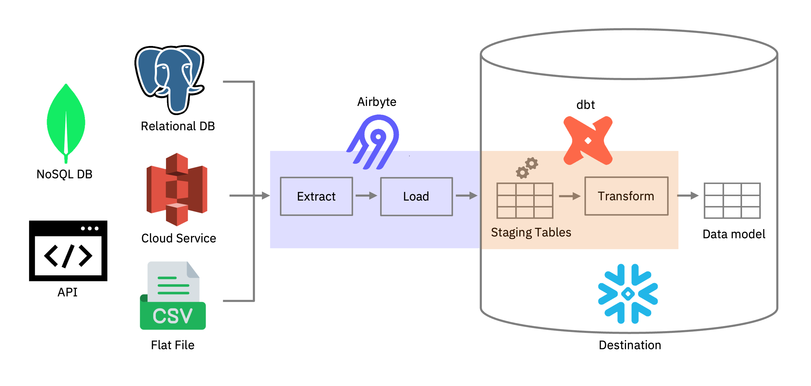

<p align="center">
   <h1 align="center">
   ELT-Bench-Verified
   <br>
   <small>Can AI Agents Automate ELT Pipelines?</small>
   </h1>
  <p align="center">
    <a>Christopher Zanoli</a><sup>1,2</sup>,
    <a>Andrea Giovannini</a><sup>1</sup>,
    <a>Tengjun Jin</a><sup>3</sup> 
    <a>Ana Klimovic</a><sup>2</sup>,
    <a>Yotam Perlitz</a><sup>1</sup>
    <br>
    <sup>1</sup>IBM Research
    <sup>2</sup>ETH Zürich
    <sup>3</sup>University of Illinois (UIUC)
  </p>

<p align="center">
    
</p>

<h3 align="center"><a href="reports/Error_Analysis.pdf">Paper</a></h3>

A comprehensive, verified, end-to-end benchmark for evaluating AI agents on full ELT (Extract, Load, Transform) pipelines.

**Based on:** [uiuc-kang-lab/ELT-Bench](https://github.com/uiuc-kang-lab/ELT-Bench)

[](https://creativecommons.org/licenses/by-sa/4.0/deed.en)

---

## What is ELT-Bench-Verified?

ELT-Bench-Verified contains **100 end-to-end ELT problems** where AI agents must:

1. **Extract** data from multiple sources (PostgreSQL, MongoDB, AWS S3, REST APIs, Flat Files)
2. **Load** data into Snowflake using Airbyte connectors
3. **Transform** data according to business requirements

<p align="center">
   
</p>

---

## Quick Start

### Prerequisites

| Tool | Purpose | Installation |
|------|---------|--------------|
| **Docker** | Source containers | [Install Docker](https://docs.docker.com/get-docker/) |
| **Conda** | Python environment | [Install Conda](https://docs.conda.io/projects/conda/en/stable/user-guide/install/index.html) |
| **Airbyte** | Data integration | See Step 2 below |
| **psql** | PostgreSQL client | [Install psql](https://www.timescale.com/blog/how-to-install-psql-on-mac-ubuntu-debian-windows) |
| **Snowflake Account** | Data destination | [Snowflake Signup](https://signup.snowflake.com/) |

### Step 1: Environment Setup

```bash
# Clone and enter repository
git clone --recursive <elt-bench-url>
cd ELT-Bench-Verified

# Create conda environment
conda create -y -n elt python=3.11
conda activate elt

# Install Python dependencies
cd setup
pip install -r requirements.txt
```

### Step 2: Install Airbyte

To install Airbyte it is recommended to use Docker Desktop as per [Airbyte documentation](https://docs.airbyte.com/platform/using-airbyte/getting-started/oss-quickstart)

If you cannot use Docker Desktop, consider the following alternatives:

#### For macOS (Colima):
```bash
brew install colima docker docker-buildx docker-compose
colima start --runtime docker --cpu 8 --memory 18
```

#### For Linux:
If you are setting up ELT-Bench on a Linux-based machine, there is no need for Docker Desktop, Docker Engine is sufficient. More info [here](https://docs.airbyte.com/platform/using-airbyte/getting-started/oss-quickstart#for-linux).


#### Install Airbyte:
```bash
curl -LsfS https://get.airbyte.com | bash -
abctl local install
```

### Step 3: Configure Airbyte

1. Navigate to [http://localhost:8000/](http://localhost:8000/)

2. Retrieve your password:
   ```bash
   abctl local credentials
   ```

3. In Airbyte UI: **Builder > Import a YAML**
   - Upload `./setup/airbyte/rest_api.yaml`
   - Click **Publish**, type `ignore warnings`, and publish

4. Go to **Sources > Custom > ELT Bench** and retrieve IDs from URL:
   ```
   http://localhost:8000/workspaces/<workspace_id>/source/new-source/<api_definition_id>
   ```

5. Create credentials file `./setup/airbyte/airbyte_credential.json`:
   ```json
   {
     "username": "your-email@example.com",
     "password": "your-airbyte-password",
     "api_definition_id": "xxxxxxxx-xxxx-xxxx-xxxx-xxxxxxxxxxxx",
     "workspace_id": "xxxxxxxx-xxxx-xxxx-xxxx-xxxxxxxxxxxx"
   }
   ```
   > **Note:** Copy IDs from **Sources > Custom > ELT Bench**, not from the Builder panel.

### Step 4: Configure Snowflake

1. Run the setup SQL in Snowflake:
   - Copy contents of `./setup/destination/setup.sql`
   - Paste into Snowflake worksheet and click **Run All**

2. Create credentials file `./setup/destination/snowflake_credential.json`:
   ```json
   {
     "account": "your-account-id",
     "user": "AIRBYTE_USER",
     "password": "Snowflake@123",
     "role": "AIRBYTE_ROLE",
     "warehouse": "AIRBYTE_WAREHOUSE"
   }
   ```

   > **Finding your account ID:** In the Snowflake activation email, look for the login URL:
   > `https://qwtrklp-zd53840.snowflakecomputing.com` → account is `qwtrklp-zd53840`
   >
   > Or: Snowflake UI > Profile icon > Account > View account details > Account identifier

   > **Important:** Use `AIRBYTE_ROLE`, not `SYSADMIN`

### Step 5: Run Setup

```bash
cd setup
bash elt_setup.sh
```

This will:
- Download source data and ground truth from Google Drive
- Start Docker containers (PostgreSQL, MongoDB, LocalStack (AWS S3), REST API)
- Populate source databases with benchmark data
- Generate agent workspaces in `data/inputs/`

### Step 6: Verify Setup

```bash
# Check all data source containers are running + airbyte
docker ps

# Expected containers:
#   elt-postgres                (port 5433)
#   elt-mongodb                 (port 27017)
#   elt-localstack              (port 4566)
#   elt-api                     (port 5005)
#   airbyte-abctl-control-plane (port 8000)
```

---

## Project Structure

### Before Setup

```
ELT-Bench-Verified/
├── README.md
├── tasks/                         # Task definitions (100 ELT problems)
│   ├── address/
│   │   ├── config.yaml            # Source configurations
│   │   ├── data_model.yaml        # Target schema requirements
│   │   └── schemas/               # Source data schemas
│   └── ... (99 more problems)
│
├── setup/                         # Setup scripts & credentials
│   ├── elt_setup.sh               # Main setup orchestrator
│   ├── write_config.py            # Workspace generator
│   ├── requirements.txt
│   ├── airbyte/
│   │   │   rest_api.yaml.                 # Custom connector (REST API source)
│   │   └── airbyte_credential.json        # User fills
│   ├── destination/
│   │   ├── setup.sql                      # Snowflake DDL
│   │   └── snowflake_credential.json      # User fills
│   ├── docker/                    # Docker infrastructure
│   │   ├── docker-compose.yml
│   │   └── rest_api/
│   │       └── app.py             # REST API server
│   ├── loaders/                   # Data loading scripts
│   │   ├── load_all.py            # Main loader orchestrator
│   │   ├── mongodb_config.json    # MongoDB mappings
│   │   ├── mongodb_loader.py      # MongoDB loader
│   │   ├── postgres_loader.py     # PostgreSQL loader
│   │   └── s3_loader.py           # S3/LocalStack loader
│   ├── schemas/                   
│   │   └── *.sql                  # Per-task SQL table schemas
│   └── workspace_files/           # Files for agent (copied to workspace)
│        ├── documentation/        # Airbyte reference docs
│        │     ├── source_postgres.md
│        │     ├── source_mongodb_v2.md
│        │     └── ...
│        ├── check_job_status.py   # Jobs status checker
│        └── main.tf               # Terraform file to configure Airbyte
│
├── evaluation/                    # Evaluation framework
│   ├── eva.py                     # Main evaluator
│   ├── eva_stage1.py              # E&L validation
│   ├── eva_stage2.py              # Transform validation
│   └── */                         # Expected SQL per problem
│
└── agents/                        # Agent implementations
    ├── spider-agent/
    └── SWE-agentv1.1.0/
```

### After Setup

```
ELT-Bench-Verified/
├── data/                          # Generated content (gitignored)
│   ├── inputs/                    # Agent workspaces
│   │   ├── address/
│   │   │   ├── config.yaml        # With credentials injected
│   │   │   ├── data_model.yaml
│   │   │   ├── schemas/
│   │   │   ├── snowflake_credential.json
│   │   │   ├── documentation/     # Agent reference docs
│   │   │   ├── elt/main.tf        # Terraform file to configure Airbyte
│   │   │   └── check_job_status.py
│   │   └── ... (99 more)
│   │
│   ├── source/                    # Downloaded source data
│   │   ├── api/                   # REST API data
│   │   └── db/                    # Database dumps
│   │
│   └── ground_truth/              # Expected outputs
│       └── */                     # Per problem
│
└── ... (original structure unchanged)
```


## Workflow Overview

### Phase 1: Setup (One-time)

```
┌─────────────────────────────────────────────────────────────────┐
│ 1. Fill credentials                                             │
│    ├── setup/airbyte/airbyte_credential.json                    │
│    └── setup/destination/snowflake_credential.json              │
├─────────────────────────────────────────────────────────────────┤
│ 2. Run setup/elt_setup.sh                                       │
│    ├── Downloads data archives (gdown)                          │
│    ├── Starts Docker containers                                 │
│    ├── Populates PostgreSQL & MongoDB                           │
│    └── Generates data/inputs/ with credentials                  │
└─────────────────────────────────────────────────────────────────┘
                              ↓
            data/inputs/ ready, Docker containers running
```

### Phase 2: Agent Execution (Per Problem)

```
┌─────────────────────────────────────────────────────────────────┐
│ Agent workspace: data/inputs/<problem>/                         │
│                                                                 │
│ 1. Read requirements                                            │
│    ├── config.yaml (source connections)                         │
│    ├── data_model.yaml (target schema)                          │
│    └── documentation/ (connector guides)                        │
├─────────────────────────────────────────────────────────────────┤
│ 2. Configure Airbyte (Extract & Load)                           │
│    ├── Create sources (Postgres, MongoDB, S3, API)              │
│    ├── Create Snowflake destination                             │
│    └── Run sync jobs                                            │
├─────────────────────────────────────────────────────────────────┤
│ 3. Transform data                                               │
│    ├── Read from AIRBYTE_SCHEMA                                 │
│    ├── Apply transformations (SQL/DBT)                          │
│    └── Write results to AIRBYTE_SCHEMA                          │
└─────────────────────────────────────────────────────────────────┘
```

### Phase 3: Evaluation

```
┌─────────────────────────────────────────────────────────────────┐
│ python evaluation/eva.py --folder <name> --example_index 0-99   │
│                                                                 │
│ Stage 1: E&L Validation                                         │
│    └── Verify source tables exist in Snowflake                  │
│                                                                 │
│ Stage 2: Transform Validation                                   │
│    └── Compare transformed output vs ground truth               │
└─────────────────────────────────────────────────────────────────┘
                              ↓
              Results saved to data/results/<folder>/
```

---

## Running Agents

See the `agents/` directory for implementations:

- **`agents/spider-agent/`** - Spider-based database agent
- **`agents/SWE-agent*/`** - Software engineering agent

Each agent directory contains its own README with setup and execution instructions.

---

## Evaluation

### Run Evaluation

```bash
cd evaluation
python eva.py --folder <run_name> --example_index <range>
```

**Parameters:**

| Parameter | Description | Examples |
|-----------|-------------|----------|
| `--folder` | Name for this evaluation run | `spider_run_1`, `test` |
| `--example_index` | Problems to evaluate | `0-99` (all), `0-4` (first 5), `2,5,7` (specific) |

**Examples:**

```bash
# Evaluate all problems
python eva.py --folder full_run --example_index 0-99

# Quick test with first 5 problems
python eva.py --folder quick_test --example_index 0-4

# Evaluate specific problems
python eva.py --folder targeted --example_index 10,25,50
```

### Results Structure

```
data/results/<folder>/
├── stage1.log    # Extraction & Load
└── stage2.log    # Transform
```

### Compute SRDEL and SRDT on results

```bash
# compute SRDEL and SRDT for results in <folder> (e.g. quick_test)
python compute_metrics.py --folder quick_test
```

The metrics.log file will be saved in the same results folder:
```
data/results/<folder>/
├── stage1.log    # Extraction & Load
├── stage2.log    # Transform
└── metrics.log   # SRDEL & SRDT
```

---

## Troubleshooting

| Issue | Solution |
|-------|----------|
| `gdown` fails | Check internet connection, Google Drive quota limits |
| Docker containers not starting | Run `docker-compose logs` in `setup/docker/` |
| Airbyte connection fails | Verify credentials in `setup/airbyte/airbyte_credential.json` |
| Snowflake connection fails | Check account ID format (lowercase, no `.snowflakecomputing.com`) |
| `data/inputs/` empty | Run `python setup/write_config.py` manually |
| MongoDB replica set error | Wait for health check, or run `docker-compose restart mongodb` |
| psql not found | Install PostgreSQL client tools (psql only, not full server) |
| Airbyte network error | Run `docker network connect docker_elt_network airbyte-abctl-control-plane` |

### Verify Docker Containers

```bash
# Check container status
docker ps --format "table {{.Names}}\t{{.Status}}\t{{.Ports}}"

# Check container logs
docker logs elt-postgres
docker logs elt-mongodb
docker logs elt-localstack
docker logs elt-api

# Restart all containers
cd setup/docker && docker-compose restart
```

### Verify Database Connectivity

```bash
# PostgreSQL
psql -h localhost -p 5433 -U postgres -d mydb -c "\dt"

# MongoDB
docker exec -it elt-mongodb mongosh --eval "show dbs"

# REST API
curl http://localhost:5005/health
```

---
