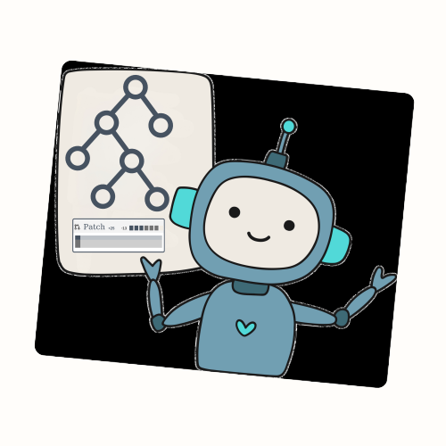

<p align="center">
  
</p>
<p align="center">
  <a href="https://drive.google.com/file/d/1DMAZ-fkirC8uKl8819cOq9J3BQ4E7GXR/view?usp=sharing">
    
  </a>
</p>
<h1 align="center">DARS: Dynamic Action Re-Sampling to Enhance Coding Agent Performance by Adaptive Tree Traversal</h1>


## Dynamic Action Re-Sampling (DARS)
DARS is a novel inference-time compute scaling approach for LLM-powered coding agents. It improves performance by dynamically branching trajectories at key decision points, using execution feedback to explore alternative actions—leading to faster and more effective recovery from sub-optimal decisions.

Our experiments and codebase are based on [SWE-agent](https://github.com/SWE-agent/SWE-agent) but can be applied to other frameworks.

---

## 🔥 Key Results on SWE-Bench Lite
- 🎯 55% pass@k
- 📈 47% pass@1
- 🏆 Outperforms state-of-the-art (SOTA) open-source frameworks
---

## 🚀 Get started!
### 🌐 Scope
This repo currently supports running the our improved SWE-Agent and DARS on SWE-Bench Lite and other datasets that follow similar formats.

### 🛠️ Installation
**1. Set up the environment:**
```bash
conda create -n dars python=3.10
conda activate dars
```

**2. Clone the repository and install dependencies:**
```bash
git clone https://github.com/darsagent/DARS-Agent.git
cd DARS-Agent/swe-agent
pip install -e .
```

**3. Configure APIs:** Add your GitHub token to the environment by updating the `keys.cfg` file with `GITHUB_TOKEN: '<your_token>'`. We utilize [LiteLLM](https://github.com/BerriAI/litellm.git) to infer models from various APIs. Depending on the model you intend to use, add the respective keys in the `keys.cfg` file (refer to [this code](sweagent/agent/models.py)).

**4. Download Repographs:** Download repographs using this [script](repograph/setup_repograph.sh)
```bash
chmod +x repograph/setup_repograph.sh
./repograph/setup_repograph.sh
```

**5. Install Docker and Pull the Image:** The agent uses a sandboxed environment to run the code. To install Docker, follow the instructions [here](https://docs.docker.com/get-docker/). Then pull the SWE-Agent Docker image and change the permissions of the Docker socket by running the following commands:
```bash
sudo chmod 666 /var/run/docker.sock
docker pull sweagent/swe-agent:latest
chmod +x ./setup.sh
./setup.sh
```

**6. Run the agent:** To run the agent on SWE-Bench Lite, use the following command:
```bash
python run_dars.py
    --model_name gpt-4o \
    --per_instance_cost_limit 10 \
    --instance_filter [all-swe-bench-instances] \
    --split test \
    --config config default_dars.yaml \
    --skip_existing true
```

**7. Evaluate the trajectory:** Now that you have run the agent, your trajectory will be saved in the [trajectories folder](trajectories). Use [this](evaluation/evaluate/extract_and_evaluate.py) script to evaluate the trajectory by passing the path to your trajectory file in the [config file](evaluation/evaluate/config.yaml).
```bash
cd evaluation/evaluate
python extract_and_evaluate.py
```

## 💫 Contributions <a name="contributions"></a>
If you'd like to contribute to the codebase, we welcome [issues](https://github.com/darsagent/DARS-Agent/issues) and [pull requests](https://github.com/darsagent/DARS-Agent/pulls)!

Some important directions to contribute:
- **Function Calling:** Currently the tools are provided to the agent in form of a message string. However, models like Claude 3.5 Sonnet are trained on function calling with specific functions. This will lead to a significant improvement in the agent's performance as our current SWE-Agent (without DARS) achieves about 32% pass@1 on SWE-Bench Lite while other agents that use function calling achieve about 40% pass@1.
- **CI/CD Pipeline and Coverage:** We are looking to add tests, improve our CI/CD pipeline, and test coverage.
- **Documentation:** We are looking to improve our documentation and make it more accessible.

Contact: **DARS Team** (Email: darsagent@gmail.com).

## 📝 Citation <a name="citation"></a>
We will add the citation once the paper is submitted to ArXiv.

## 🪪 License <a name="license"></a>
MIT. Check `LICENSE`.